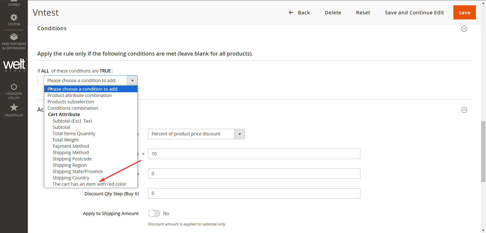
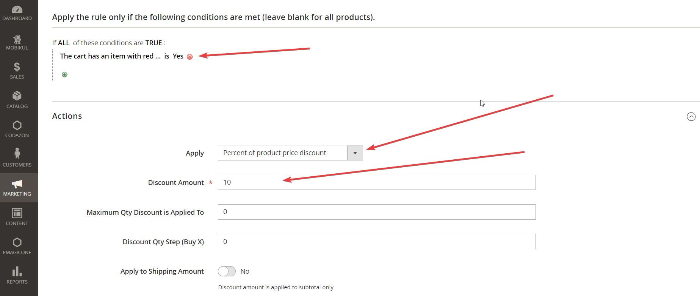
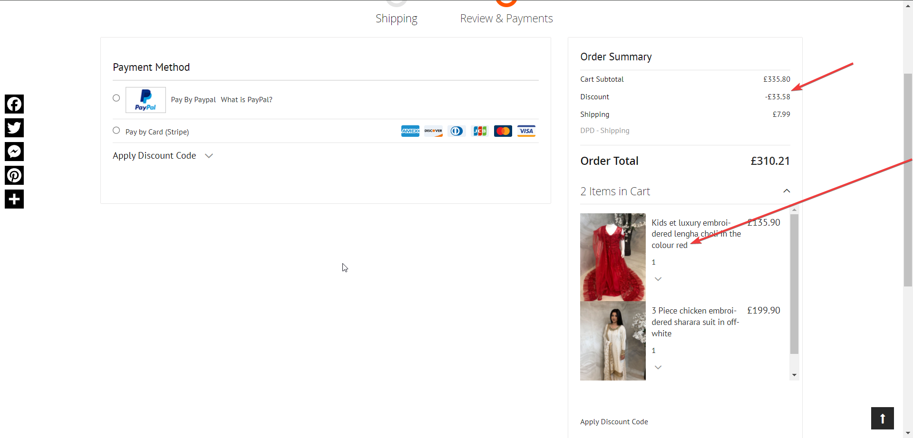

This is a simple test module that creates additional conditions for Cart Price Rules in Magento 2.

The condition is “The cart has an item with red color” - it checks whether there is an item in the
cart that has the attribute “color” with the value “Red”. (For example a t-shirt where the customer
chose red as a color configuration)

For example, it is possible to create a cart rule like the following - “If the cart
has an item with red color, apply a 10% discount”

Backend condition

Frontend view

